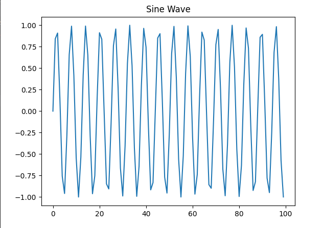

# 📊 Plotting with Python: A Matplotlib Mini Gallery

Welcome to my tiny gallery of visual storytelling using **Matplotlib** – one of Python’s most powerful visualization libraries. This repo is a quick-start guide for beginners and a mini reference deck for anyone looking to make their data speak through visuals.

This collection aims to demystify `matplotlib` by providing straightforward, runnable scripts for various plot types. Dive in and see how easy it is to create stunning visuals!

---
## What is Matplotlib?

`Matplotlib` is a comprehensive library for creating static, animated, and interactive visualizations in Python. It's an incredibly versatile tool, offering a vast array of plotting capabilities, from simple line graphs to complex 3D plots. 

Whether you're doing data exploration, scientific research, or preparing reports, `matplotlib` provides the tools to bring your data to life.


## 🌟 What’s Inside?

This repo contains **bite-sized scripts**, each dedicated to a different type of plot. No fuss, no fluff — just clean code and clear charts.

| 📄 File        | 📈 Plot Type        | 🔍 Purpose                                  |
|---------------|---------------------|---------------------------------------------|
| `line.py`     | Line Plot           | Trends over time or ordered data            |
| `bar.py`      | Bar Chart           | Comparing categories                        |
| `scatter.py`  | Scatter Plot        | Distributions, clusters, and relationships  |
| `histogram.py`| Histogram           | Frequency distributions                     |
| `pie.py`      | Pie Chart           | Proportional data (with flair!)             |
| `boxplot.py`  | Box Plot            | Spread and outliers                         |
| `subplot.py`  | Subplots            | Multiple charts in one canvas               |

---

## Getting Started

To run these examples, you will need:

* Python (3.x recommended)
* Matplotlib library

## Installation

1.  **Clone this repository** (if applicable, otherwise just download the files):
    ```bash
    # If this were a Git repository
    # git clone <repository_url>
    # cd matplotlib-examples
    ```

2.  **Install matplotlib**:
    ```bash
    pip install matplotlib
    ```

## 💡 Usage

To run any of the examples, simply execute the corresponding Python script from your terminal:

```bash
python <filename>.py
```
For example, to run the line plot example:
```
python line.py
```

This will typically open a window displaying the generated plot.

---

## 👀 Visual Previews

Here's a glimpse of the plots you can generate with these scripts:

### Line Plot



### Bar Chart


### Histogram


### Box Plot


### Scatter Plot


### Pie Chart


### Sub Plot


---


## 🎯 Why this Repo??

I built this as part of my journey into **data science & machine learning**, and wanted a simple, structured way to understand:

- What each plot is used for
- How to quickly generate it
- How to tweak it (titles, colors, labels)


---

